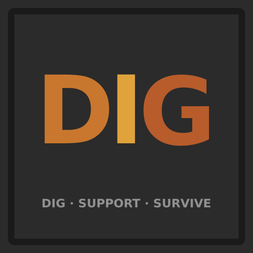

<p align="center"></p>

# Diggy

> **The world is solid rock. Mind the ceiling.**

A Factorio 2.0 mod where Nauvis starts as one black slab of stone. You dig the factory out by hand, and every cave you carve is held up only by what you leave standing — pull too much rock and the ceiling comes down on you. A standalone reimagining of [RedMew's Diggy scenario](https://github.com/Refactorio/RedMew), rebuilt as a mod with first-class optional [Multi-Team Support](https://mods.factorio.com/mod/multi-team-support) integration.

> **A new map, always.** The world is generated by the mod as you dig — it can't take over an existing save. Start a fresh map to play.

> **Inspired by RedMew's Diggy.** This is a from-scratch reimagining for Factorio 2.0, not a port: the ceiling-stress model, the cavern system, and the threat economy are all new. Licensed GPL-3.0, like the original.

> **Note on tooling:** This mod is developed with AI coding assistants alongside human review and in-game testing. Bug reports, feature requests, and contributions are welcome from everyone. There's a human on the other side — please keep it kind.

## 💬 Community

Join the Discord: https://discord.gg/tWz4FT74pH

## ✨ Features

### ⛏️ Dig the world out
- 🌑 **Everything is rock** — Nauvis generates as out-of-map void built into caves at runtime. Only the space you've revealed exists; there are no spoilers waiting in the dark.
- 🪓 **Dig by hand or by force** — Mine the frontier wall, or break it with explosives, fire, vehicles, and gunfire. Construction robots *cannot* deconstruct it, so digging is always a deliberate act. Tree-cover patches clear faster — but they burn.
- 💎 **Ore veins materialize as you dig** — Resources are computed from the map seed at the moment a tile opens, not pre-placed. Veins fatten and richen with depth, and the first exposure of each ore announces to your team.
- 🎁 **Sealed treasure** — Loot chests are buried in the rock at fixed, seed-keyed spots; contents scale with how deep you found them.

### 🕳️ Caverns
- 🐍 **Tunnels carve at dig time** — A seed-keyed roll can breach a snaking tunnel, sometimes ending in a room. Fixed per map seed, so every team meets the same caves.
- 🏛️ **Rooms have personalities** — Empty caves, **nest rooms** (spawners guarded by worms), **hoard rooms** (chest clusters), and rare **sanctuaries** (grass, water, fish — a safe breath), gated by depth.
- 🪱 **Worm-guarded ceilings** — While a room's worms live, nothing in it can collapse — the only way in is to fight. Kill the last guardian and the ancient ceiling **arms**: a countdown, then it sheds. Shore it up in time and it holds.

### 🪨 Cave collapses
- 📐 **Stress is pure geometry** — A ceiling cell's load is computed live from what's actually around it (open floor minus nearby support), never accumulated in hidden bookkeeping. Identical layouts always read identically, and collapses happen exactly where the rock says they should.
- 🧱 **Hold it up** — Remaining rock, stone walls, nuclear reactors, and stone/concrete flooring all brace the ceiling. The spawn cave comes pre-pillared so your homestead starts safe.
- ⚠️ **You can see the danger** — Strain shows as warning triangles in ALT view, shading yellow→red and fading faint→solid by severity. Every failing tile gets a box, a live countdown, and an honest verdict: **COLLAPSE!** when it falls, **IT HOLDS!** when your supports save it.
- 💀 **Crushed, not gone** — Buildings caught in a cave-in are buried with their inventories; dig them back out to recover the materials (opt-in; off by default).
- 🎚️ **Tune the difficulty live** — Host settings for wall strength, the Support Struts ceiling, a wall-crowding penalty (so solid wall lines can't cheese support), and the cavern countdown — all apply mid-game.

### 🔬 Research
- ⚡ **Dig speed** — 35 tiers of manual-mining speed for the whole team, ramping deep into the game.
- 🏗️ **Support struts** — Six tiers that extend the reach of *every* wall and reactor the instant a tier completes, so pillars can stand further apart.

### 👾 Threats come from digging
- 🥚 **Hostiles only exist once dug up** — Enemies enter the world only as dig spawns and room contents; vanilla biter expansion is off by default, so the caves stay exactly as dangerous as your digging makes them.
- 📊 **Depth-gated tiers** — Deeper digs unlock meaner threats. Evolution rises from what you *fight* (the nests you clear), not from the act of digging.
- 🦂 **Bundled adapters** — Detected content mods get wired in automatically, so their enemies can surface from the deep tier-banded by depth and weakened on first contact.

### 🤝 Multi-Team Support *(auto-detected)*
- 🌍 **Per-team cave worlds, identically seeded** — Each team digs its own copy of the exact same world. Every dig outcome (veins, tunnels, treasure, spawns) is derived from the map seed, so races are fair down to the tile.
- 📢 **Cross-team collapse alerts** — A team's cave-in can broadcast to rivals with the suffering team's colored label (host-toggleable). Player-less digs (fire, biters chewing the wall) are attributed to the surface's owning team.

## ⚙️ Compatibility

- Requires **Factorio 2.0** (`base >= 2.0`) and a **brand-new map**.
- **[Multi-Team Support](https://mods.factorio.com/mod/multi-team-support)** — optional; auto-detected for per-team cave worlds and cross-team alerts.
- **Space Age** — optional; supported where present.
- **Content/enemy mods** — bundled adapters detect supported mods and register their threats with no cooperation required from those mods.

## ⌨️ Commands

Admin-only testing tools:

- `/diggy-kit` — Test kit: 4× mining, a stack of walls, and powered MK2 armor (shields, lasers, roboports, bots), all pre-charged.
- `/diggy-mine <n>` — Set your character mining-speed modifier directly (default 10). Resets on death.
- `/diggy-stress` — Show live ceiling-stress values around you for 10 seconds.
- `/diggy-sim [bare|slow|stop]` — Repeatable collapse benchmark that clears a hall beside you and reports a pass/fail verdict; `slow` is watchable with a live stress overlay.

## 🔌 For Mod Authors

Diggy exposes a versioned remote interface (`diggy-v1`) so other mods can add their own enemies to the dig-spawn pool — declaratively, with no Diggy-specific code paths. Rolls stay seed-keyed, so registered threats appear identically across all teams.

```lua
if remote.interfaces["diggy-v1"] then
    remote.call("diggy-v1", "register_threat", {
        name      = "my-mod-crawlers",                  -- unique id (re-registering by name replaces)
        entities  = { "small-crawler", "big-crawler" }, -- ordered weakest → strongest
        min_depth = 120,                                -- only digs deeper than this can roll it
        chance    = 0.04,                               -- per-dig chance once gated
        announce  = "my-mod.crawler-warning",           -- optional locale key shown to the team
    })
end
```

Register it from a deferred one-shot (not directly in `on_load`); the interface name is versioned, so breaking changes will ship as a parallel `diggy-v2` rather than mutating v1.

## 📚 Design docs

- [CONTEXT.md](CONTEXT.md) — the project glossary (frontier wall, dig, stress, caverns, crushed remains…)
- [docs/adr/](docs/adr/) — architecture decisions and why (the void world, seed-keyed determinism, the geometric stress engine…)
- [docs/SPIKE.md](docs/SPIKE.md) — the engine spike that validated the architecture
- [docs/BACKLOG.md](docs/BACKLOG.md) — deferred decisions and roadmap

## 🛠️ Development

```sh
./link-mod.sh        # symlink this repo into your Factorio mods dirs
./tools/release.sh   # tag + push a release (CI builds the zip and uploads to the portal)
```

## 📄 License

[GNU GPL v3](LICENSE) — derived from RedMew's GPL-3.0 Diggy scenario.
